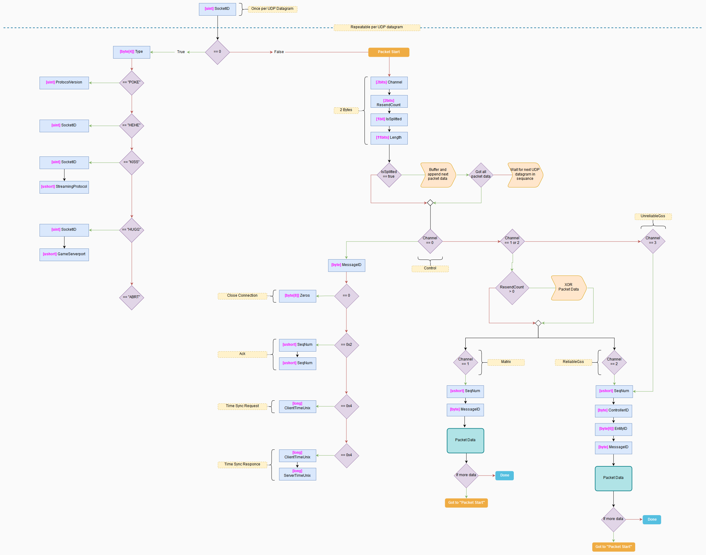
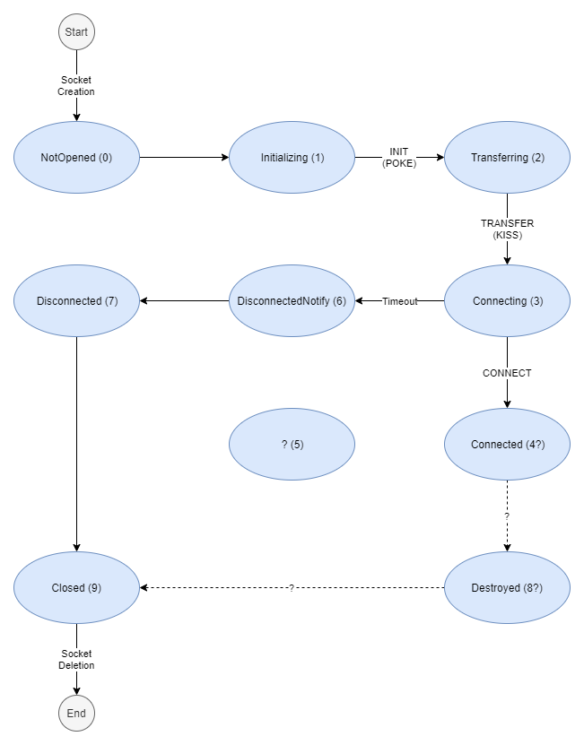

# Networking

## Web API

Partially documented Web APIs as OpenAPI specification:

### Operator

| Method | Endpoint                       | Listed | Request | Response | Build |
|--------|--------------------------------|--------|---------|----------|-------|
| GET    | /api/v1/products/Firefall_Beta | ✔️     | ✔️     | ✔️      | 1869  |
| GET    | /check                         | ✔️     | ✔️     | ✔️      | 1869  |

### In-Game

| Method | Endpoint                            | Listed | Request | Response | Build |
|--------|-------------------------------------|--------|---------|----------|-------|
| GET    | /armies                             | ❌     | ❌     | ❌      | 1788  |
| GET    | /armies/[id].json                   | ❌     | ❌     | ❌      | 1710  |
| GET    | /armies/[id]/ranks                  | ❌     | ❌     | ❌      | 1788  |
| GET    | /armies/[id]/rooster                  | ❌     | ❌     | ❌      | 1788  |
| GET    | /dashboard/promotions               | ❌     | ❌     | ❌      | 1869  |
| GET    | /dashboard/store_products           | ❌     | ❌     | ❌      | 1869  |
| GET    | /characters/data                    | ❌     | ❌     | ❌      | 1710  |
| GET    | /inventory/resource_quantities.json | ❌     | ❌     | ❌      | 1710  |
| GET    | /inventory/wallet_balance.json      | ❌     | ❌     | ❌      | 1710  |
| GET    | /login_alerts                       | ✔️     | ✔️     | ✔️      | 1869  |
| GET    | /matchmaker/join_pvp.js             | ❌     | ❌     | ❌      | 1710  |
| GET    | /matchmaker/replay_matches.js       | ❌     | ❌     | ❌      | 1710  |
| GET    | /panelmanager                       | ❌     | ❌     | ❌      | 1869  |
| GET    | /tooltip.html                       | ❌     | ❌     | ❌      | 1710  |
| GET    | /tooltip-container.html             | ❌     | ❌     | ❌      | 1710  |
| GET    | /zone_settings?join_melding.js      | ❌     | ❌     | ❌      | 1710  |

### Client API

| Method | Endpoint                                                            | Listed | Request | Response | Build |
|--------|---------------------------------------------------------------------|--------|---------|----------|-------|
| GET    | /api/v1/characters/[id]/data                                        | ❌     | ❌     | ❌      | 1869  |
| GET    | /api/v1/characters/[id]/friends                                     | ❌     | ❌     | ❌      | 1869  |
| GET    | /api/v1/characters/[id]/session_count                               | ❌     | ❌     | ❌      | 1710  |
| POST   | /api/v1/client_event                                                | ❌     | ❌     | ❌      | 1869  |
| GET    | /api/v1/inventory/positions.json                                    | ❌     | ❌     | ❌      | 1710  |
| POST   | /api/v1/mail/batch/mark_read                                        | ❌     | ❌     | ❌      | 1788  |
| GET    | /api/v1/mail/retrieve                                               | ❌     | ❌     | ❌      | 1788  |
| POST   | /api/v1/oracle/ticket                                               | ✔️     | ❌     | ❌      | 1869  |
| GET    | /api/v1/vendor/[id]/products.json                                   | ❌     | ❌     | ❌      | 1710  |
| POST   | /api/v1/vendor/[id]/purchase                                        | ❌     | ❌     | ❌      | 1710  |
| POST   | /api/v1/server/list                                                 | ✔️     | ✔️     | ✔️      | 1869  |
| GET    | /api/v1/social/friend_list.json                                     | ✔️     | ✔️     | ❌      | 1869  |
| GET    | /api/v1/social/static_data.json                                     | ✔️     | ✔️     | ❌      | 1869  |
| POST   | /api/v2/accounts/change_language                                    | ✔️     | ✔️     | ✔️      | 1869  |
| POST   | /api/v2/accounts/current/status                                     | ❌     | ❌     | ❌      | 1788  |
| POST   | /api/v2/accounts/login                                              | ✔️     | ✔️     | ❌      | 1869  |
| GET    | /api/v2/characters/[id]/battleframes/[id]/constraint_levels         | ❌     | ❌     | ❌      | 1710  |
| POST   | /api/v2/characters/[id]/battleframes/[id]/constraint_levels/upgrade | ❌     | ❌     | ❌      | 1710  |
| GET    | /api/v2/characters/[id]/mail                                        | ❌     | ❌     | ❌      | 1869  |
| GET    | /api/v2/characters/[id]/market/listings                             | ❌     | ❌     | ❌      | 1869  |
| GET    | /api/v2/characters/[id]/visual_loadouts                             | ❌     | ❌     | ❌      | 1869  |
| GET    | /api/v2/characters/[id]/unlocks/active_dialog_script                | ❌     | ❌     | ❌      | 1788  |
| GET    | /api/v2/characters/[id]/unlocks/tech_trees                          | ❌     | ❌     | ❌      | 1710  |
| GET    | /api/v2/characters/list                                             | ✔️     | ✔️     | ✔️      | 1869  |
| POST   | /api/v2/market/search/item_sdb_ids                                  | ❌     | ❌     | ❌      | 1869  |
| GET    | /api/v2/market/search/tokens/[id]:[id]                              | ❌     | ❌     | ❌      | 1869  |
| GET    | /api/v2/zone_settings                                               | ❌     | ❌     | ❌      | 1869  |
| GET    | /api/v3/armies/[id]                                                 | ❌     | ❌     | ❌      | 1869  |
| GET    | /api/v3/armies/[id]/applications                                    | ❌     | ❌     | ❌      | 1869  |
| GET    | /api/v3/armies/[id]/ranks                                           | ❌     | ❌     | ❌      | 1869  |
| GET    | /api/v3/armies/[id]/members                                         | ❌     | ❌     | ❌      | 1869  |
| GET    | /api/v3/armies/[id]/members/[id]/rank                               | ❌     | ❌     | ❌      | 1869  |
| GET    | /api/v3/characters/[id]/inventories/bag                             | ❌     | ❌     | ❌      | 1710  |
| GET    | /api/v3/characters/[id]/inventories/crafting                        | ❌     | ❌     | ❌      | 1710  |
| GET    | /api/v3/characters/[id]/inventories/gear/items                      | ❌     | ❌     | ❌      | 1710  |
| POST   | /api/v3/characters/[id]/items/repair                                | ❌     | ❌     | ❌      | 1710  |
| GET    | /api/v3/characters/[id]/login_streak                                | ❌     | ❌     | ❌      | 1869  |
| GET    | /api/v3/characters/[id]/garage_slots                                | ❌     | ❌     | ❌      | 1869  |
| POST   | /api/v3/characters/[id]/garage_slots/[id]                           | ❌     | ❌     | ❌      | 1710  |
| GET    | /api/v3/characters/[id]/garage_slots/[id]/perks                     | ❌     | ❌     | ❌      | 1788  |
| GET    | /api/v3/characters/[id]/manufacturing/certs                         | ❌     | ❌     | ❌      | 1788  |
| POST   | /api/v3/characters/[id]/manufacturing/preview                       | ❌     | ❌     | ❌      | 1869  |
| POST   | /api/v3/characters/[id]/manufacturing/workbenches                   | ❌     | ❌     | ❌      | 1710  |
| POST   | /api/v3/characters/[id]/manufacturing/workbenches/[id]/load         | ❌     | ❌     | ❌      | 1869  |
| POST   | /api/v3/characters/[id]/manufacturing/workbenches/[id]/unload       | ❌     | ❌     | ❌      | 1869  |
| GET    | /api/v3/characters/[id]/titles                                      | ❌     | ❌     | ❌      | 1710  |
| POST   | /api/v3/characters/[id]/titles/set_title                            | ❌     | ❌     | ❌      | 1788  |
| GET    | /api/v3/characters/[id]/tutorial_status                             | ❌     | ❌     | ❌      | 1710  |
| GET    | /api/v3/characters/[id]/visuals                                     | ❌     | ❌     | ❌      | 1710  |
| GET    | /api/v3/daily_rewards                                               | ❌     | ❌     | ❌      | 1869  |
| GET    | /api/v3/garage_slots/battleframes_for_sale                          | ❌     | ❌     | ❌      | 1869  |
| POST   | /api/v3/trade/products                                              | ❌     | ❌     | ❌      | 1869  |
| GET    | /api/v3/trade/products/garage_slot_perk_respec                      | ❌     | ❌     | ❌      | 1869  |
| GET    | /api/v3/trade/products/inventory_expansion                          | ❌     | ❌     | ❌      | 1869  |
| GET    | /api/v3/trade/products/workbench                                    | ❌     | ❌     | ❌      | 1869  |
| POST   | /api/v3/ui_actions                                                  | ❌     | ❌     | ❌      | 1869  |

### Market

| Method | Endpoint                          | Listed | Request | Response | Build |
|--------|-----------------------------------|--------|---------|----------|-------|
| POST   | /api/v1/buy/[id]                  | ✔️     | ❌     | ❌      | 1679  |
| GET    | /api/v1/item_display_attributes   | ✔️     | ✔️     | ✔️      | 1679  |
| POST   | /api/v1/listings/[id]/cancel      | ✔️     | ❌     | ❌      | 1679  |
| POST   | /api/v1/listings/[id]/reap        | ✔️     | ❌     | ❌      | 1679  |
| GET    | /api/v1/market_categories         | ✔️     | ✔️     | ✔️      | 1679  |
| GET    | /api/v1/my_listings               | ✔️     | ❌     | ❌      | 1679  |
| GET    | /api/v1/resources/stat_names      | ✔️     | ❌     | ❌      | 1679  |
| GET    | /api/v1/resources/[id]/stat_names | ✔️     | ❌     | ❌      | 1679  |
| GET    | /api/v1/search                    | ✔️     | ❌     | ❌      | 1679  |
| POST   | /api/v1/sell_item                 | ✔️     | ❌     | ❌      | 1679  |
| POST   | /api/v1/sell_resource             | ✔️     | ❌     | ❌      | 1679  |
| POST   | /ingame/buy                       | ✔️     | ❌     | ❌      | 1679  |
| POST   | /ingame/sell                      | ✔️     | ❌     | ❌      | 1679  |
| GET    | /items                            | ✔️     | ❌     | ❌      | 1679  |
| GET    | /resources                        | ✔️     | ❌     | ❌      | 1679  |

### Launcher

| Method | Endpoint                        | Listed | Request | Response | Build |
|--------|---------------------------------|--------|---------|----------|-------|
| GET    | /launcher                       | ✔️     | ✔️     | ❌      | 1869  |

### Further Reading

- Display the OpenAPI spec in a nice way: https://editor.swagger.io/
- Firefall API documentation: https://firefall.gamepedia.com/Ingame_Host

## Game Server

See [Game Server Protocol Overview](https://github.com/themeldingwars/Documentation/wiki/Game-Server-Protocol-Overview) on the wiki.

